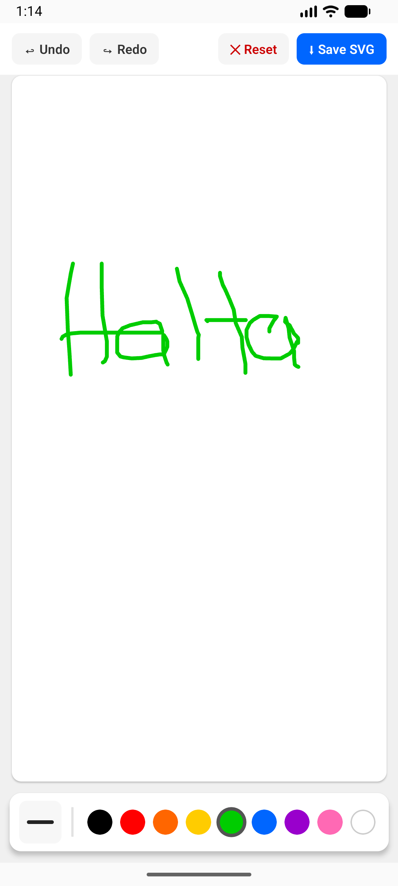

# ✏️ Drawing App — React Native Skia

A smooth, performant drawing application built with React Native and React Native Skia. Draw freely on a canvas with touch gestures, supporting multiple brush sizes, colors, and undo/redo functionality.

---

## 📸 Screenshots



---

## 🚀 Features

- Freehand drawing with touch input
- Customizable brush size and color
- Undo / Redo support
- Clear canvas
- Smooth 60fps rendering powered by Skia
- Works on both iOS and Android

---

## 🛠️ Tech Stack

| Library | Purpose |
|---|---|
| [React Native](https://reactnative.dev/) | Cross-platform mobile framework |
| [@shopify/react-native-skia](https://shopify.github.io/react-native-skia/) | High-performance 2D canvas rendering |
| [React Native Gesture Handler](https://docs.swmansion.com/react-native-gesture-handler/) | Touch and gesture input |
| [React Native Reanimated](https://docs.swmansion.com/react-native-reanimated/) | Shared value animations |
| [react-native-blob-util](https://github.com/RonRadtke/react-native-blob-util) | Writing snapshot to temp cache file |
| [@react-native-camera-roll/camera-roll](https://github.com/react-native-cameraroll/react-native-cameraroll) | Saving image to device gallery |

---

## 📦 Installation

### Prerequisites

- Node.js >= 18
- React Native CLI or Expo (with dev client)
- Xcode (for iOS)
- Android Studio (for Android)

### Steps

```bash
# Clone the repository
git clone https://github.com/your-username/drawing-app-rn.git
cd drawing-app-rn

# Install dependencies
npm install
# or
yarn install

# iOS — install pods
cd ios && pod install && cd ..
```

---

## ▶️ Running the App

```bash
# Android
npx react-native run-android

# iOS
npx react-native run-ios
```

---

## 🧠 How It Works

Drawing is implemented by tracking touch gesture coordinates and constructing Skia `Path` objects in real time. Each stroke is stored as a path with its associated paint properties (color, stroke width, etc.), enabling undo/redo by simply maintaining a stack of strokes.

React Native Skia renders all paths on a `<Canvas>` component, which runs on the UI thread via JSI for buttery-smooth performance without bridge overhead.

### 💾 Saving to Camera Roll

To save the drawing, `makeImageSnapshot()` is called on the canvas ref, which captures a pixel-perfect snapshot of the Skia canvas. The snapshot is then encoded to a base64 PNG string and written to a temporary cache file using `react-native-blob-util`. Once the file is written, it is saved to the device's camera roll via `@react-native-camera-roll/camera-roll`, and the temp file is cleaned up afterward.

```ts
const image = canvasRef.current?.makeImageSnapshot();
const base64 = image.encodeToBase64();
const path = `${ReactNativeBlobUtil.fs.dirs.CacheDir}/drawing_${Date.now()}.png`;
await ReactNativeBlobUtil.fs.writeFile(path, base64, "base64");
await CameraRoll.saveAsset(`file://${path}`, { type: "photo" });
await ReactNativeBlobUtil.fs.unlink(path);
```

---

## 📄 License

MIT © 2026 Nguyen Dinh Anh Tuan

---

## 🙏 Credits

This project was built following the excellent tutorial:

**"Building a Drawing App with React Native Skia"**
by the Notesnook team
🔗 https://blog.notesnook.com/drawing-app-with-react-native-skia/

Special thanks to the [Shopify](https://shopify.github.io/react-native-skia/) team for creating and maintaining React Native Skia.